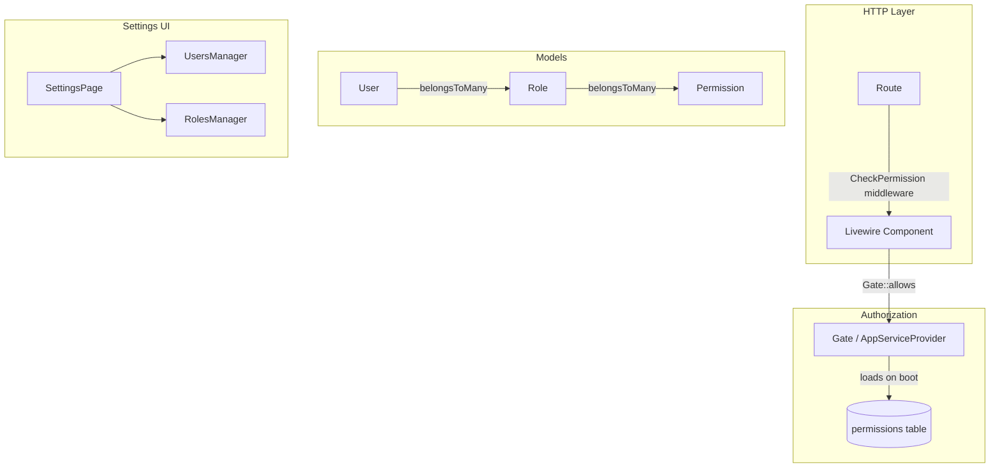
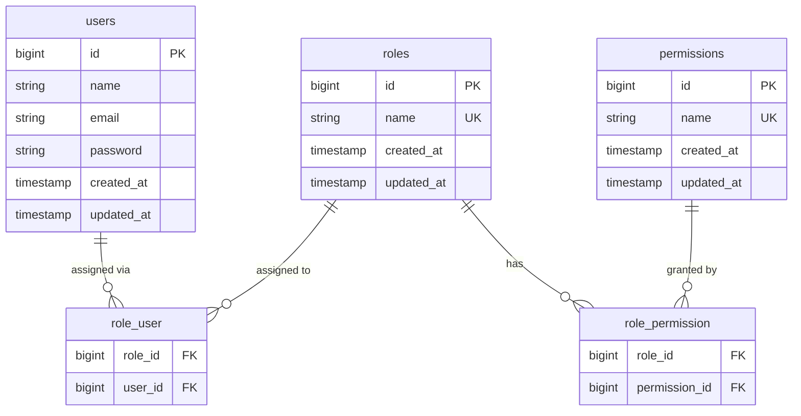

# Design Document: Roles and Permissions

## Overview

This document describes the technical design for a granular Role-Based Access Control (RBAC) system built natively on top of the existing Laravel 11 + Livewire 3 application. The system introduces `Role` and `Permission` models, a custom `HasRoles` trait on `User`, Laravel Gates for permission checking, a `CheckPermission` middleware for route-level enforcement, and two new Livewire components (`RolesManager`, `UsersManager`) integrated into the existing Settings page.

The design avoids third-party RBAC packages (e.g., Spatie) to keep the dependency footprint minimal and to stay consistent with the existing codebase style.

### Key Design Decisions

- **Custom RBAC over Spatie**: The application is small and well-scoped; a hand-rolled solution avoids a heavy dependency and gives full control over the schema.
- **Permissions as `module.action` strings**: Stored as a `name` column (e.g., `invoices.edit`), making them easy to check with `Gate::allows('invoices.edit')`.
- **Gates registered dynamically at boot**: `AppServiceProvider` loads all permissions from the DB once and registers a Gate for each, with a short-circuit for the `admin` role.
- **Middleware for routes, Gate checks inside Livewire**: Routes get a `permission:module.view` middleware; mutating Livewire actions call `$this->authorize()` or `Gate::allows()` directly.
- **Settings page integration via tab**: A new "Users & Roles" tab is added to the existing `SettingsPage` component, visible only to admins.

---

## Architecture



### Request Lifecycle

1. Authenticated request hits a protected route.
2. `CheckPermission` middleware resolves the required permission from the route name (e.g., `invoices` → `invoices.view`) and calls `Gate::allows`.
3. Gate checks if the user has the `admin` role (short-circuit allow) or if any of the user's roles contains the required permission.
4. On allow: Livewire component renders. On deny: redirect to dashboard with 403 notification.
5. Inside the component, mutating actions (`save`, `delete`, `export`) call `Gate::allows` again before executing, providing defense-in-depth.

---

## Components and Interfaces

### Middleware: `CheckPermission`

```
app/Http/Middleware/CheckPermission.php
```

- Registered as `permission` alias in `bootstrap/app.php`.
- Accepts a permission string parameter: `permission:invoices.view`.
- If unauthenticated → redirect to login.
- If authenticated but unauthorized → redirect to `dashboard` with a session flash error.

### Trait: `HasRoles` (on User model)

```
app/Models/Concerns/HasRoles.php
```

Methods:
- `roles(): BelongsToMany` — relationship to `roles` table.
- `hasRole(string $role): bool` — checks if user has a named role.
- `hasPermission(string $permission): bool` — checks if any assigned role contains the permission.
- `isAdmin(): bool` — shorthand for `hasRole('admin')`.

### Gate Registration (AppServiceProvider)

On `boot()`:
- Load all `Permission` records from DB (cached with `Cache::remember`).
- For each permission, register `Gate::define($permission->name, fn(User $user) => $user->isAdmin() || $user->hasPermission($permission->name))`.
- Register a `before` callback: `Gate::before(fn(User $user) => $user->isAdmin() ? true : null)`.

### Livewire Components

#### `App\Livewire\Settings\UsersManager`

Manages user CRUD and role assignment. Embedded in `SettingsPage` when `activeSection === 'users'`.

Public properties: `$users` (paginated), `$editingUserId`, `$name`, `$email`, `$password`, `$selectedRoles[]`, `$confirmingDeleteId`.

Key methods:
- `createUser()` — validates and creates user, assigns roles.
- `editUser(int $id)` — loads user into form.
- `updateUser()` — validates and saves; skips password if blank.
- `deleteUser(int $id)` — checks sole-admin guard, then deletes.
- `assignRoles(int $userId, array $roleIds)` — syncs pivot.

#### `App\Livewire\Settings\RolesManager`

Manages role CRUD and permission matrix. Embedded in `SettingsPage` when `activeSection === 'roles'`.

Public properties: `$roles`, `$editingRoleId`, `$roleName`, `$rolePermissions[]` (keyed `module.action`), `$confirmingDeleteId`.

Key methods:
- `createRole()` — validates unique name, creates role.
- `editRole(int $id)` — loads role + permissions into form.
- `saveRole()` — updates name and syncs permissions via pivot.
- `deleteRole(int $id)` — checks for assigned users and admin guard.
- `getPermissionMatrix()` — returns structured array of modules × actions.

### Settings Page Integration

`SettingsPage` gains two new section keys: `'users'` and `'roles'`. The sidebar tab for "Users & Roles" is rendered conditionally:

```blade
@if(auth()->user()->isAdmin())
    <button wire:click="switchSection('users')">Users</button>
    <button wire:click="switchSection('roles')">Roles & Permissions</button>
@endif
```

When `activeSection` is `'users'` or `'roles'`, the view includes the respective Livewire component via `<livewire:settings.users-manager />` or `<livewire:settings.roles-manager />`.

---

## Data Models

### Schema



### Migrations

**`create_roles_table`**
```php
Schema::create('roles', function (Blueprint $table) {
    $table->id();
    $table->string('name')->unique();
    $table->timestamps();
});
```

**`create_permissions_table`**
```php
Schema::create('permissions', function (Blueprint $table) {
    $table->id();
    $table->string('name')->unique(); // e.g. "invoices.edit"
    $table->timestamps();
});
```

**`create_role_user_table`**
```php
Schema::create('role_user', function (Blueprint $table) {
    $table->foreignId('role_id')->constrained()->cascadeOnDelete();
    $table->foreignId('user_id')->constrained()->cascadeOnDelete();
    $table->primary(['role_id', 'user_id']);
});
```

**`create_role_permission_table`**
```php
Schema::create('role_permission', function (Blueprint $table) {
    $table->foreignId('role_id')->constrained()->cascadeOnDelete();
    $table->foreignId('permission_id')->constrained()->cascadeOnDelete();
    $table->primary(['role_id', 'permission_id']);
});
```

### Model Relationships

**`Role` model**
```php
class Role extends Model {
    protected $fillable = ['name'];

    public function permissions(): BelongsToMany {
        return $this->belongsToMany(Permission::class);
    }

    public function users(): BelongsToMany {
        return $this->belongsToMany(User::class);
    }
}
```

**`Permission` model**
```php
class Permission extends Model {
    protected $fillable = ['name'];

    public function roles(): BelongsToMany {
        return $this->belongsToMany(Role::class);
    }
}
```

**`User` model** — gains `HasRoles` trait:
```php
use App\Models\Concerns\HasRoles;

class User extends Authenticatable {
    use HasFactory, Notifiable, HasRoles;
    // ...
}
```

### Permission Naming Convention

Permissions follow the pattern `{module}.{action}`:

| Module             | Actions                          |
|--------------------|----------------------------------|
| dashboard          | view                             |
| invoices           | view, create, edit, delete, export |
| movements          | view, create, edit, delete, export |
| bank_accounts      | view, create, edit, delete       |
| expenses           | view, create, edit, delete       |
| credit_lines       | view, create, edit, delete       |
| companies_clients  | view, create, edit, delete       |
| reports            | view                             |
| reminders          | view, create, edit, delete       |
| settings           | view, edit                       |
| users              | view, create, edit, delete       |

### Seeder Strategy

`RolesAndPermissionsSeeder` (called from `DatabaseSeeder`):

1. For every module/action pair above, call `Permission::firstOrCreate(['name' => "$module.$action"])`.
2. `Role::firstOrCreate(['name' => 'admin'])` → sync all permissions.
3. `Role::firstOrCreate(['name' => 'viewer'])` → sync only `*.view` permissions.
4. If no user currently has the `admin` role, assign it to `User::first()`.

---

## Correctness Properties

*A property is a characteristic or behavior that should hold true across all valid executions of a system — essentially, a formal statement about what the system should do. Properties serve as the bridge between human-readable specifications and machine-verifiable correctness guarantees.*

### Property 1: Admin role is undeletable

*For any* database state, the `admin` role record SHALL always exist after any delete operation is attempted on it.

**Validates: Requirements 1.7, 7.1**

### Property 2: Role deletion blocked when users assigned

*For any* role that has one or more users assigned, attempting to delete that role SHALL leave the role and all its user assignments unchanged.

**Validates: Requirements 1.5**

### Property 3: Permission sync round-trip

*For any* role and any arbitrary set of permission names, saving that permission set and then reloading the role's permissions SHALL return exactly the same set.

**Validates: Requirements 2.2**

### Property 4: Admin implicit allow

*For any* permission string and any user who holds the `admin` role, `Gate::allows($permission, $user)` SHALL return `true` regardless of what permissions are explicitly stored.

**Validates: Requirements 5.3**

### Property 5: No-role user is denied all modules

*For any* user with no roles assigned, `Gate::allows($permission, $user)` SHALL return `false` for every module permission except the user's own profile.

**Validates: Requirements 4.5**

### Property 6: Union of role permissions

*For any* user assigned multiple roles, the effective permission set SHALL equal the union of all permissions across all assigned roles.

**Validates: Requirements 4.4**

### Property 7: View-less module implies all actions denied

*For any* role that lacks `{module}.view`, `Gate::allows('{module}.{action}', $user)` SHALL return `false` for all actions on that module for users holding only that role.

**Validates: Requirements 2.5**

### Property 8: Sole-admin deletion prevention

*For any* system state where exactly one user holds the `admin` role, attempting to delete that user SHALL be rejected and the user record SHALL remain in the database.

**Validates: Requirements 3.8, 7.1**

### Property 9: Duplicate role name rejected

*For any* existing role name, submitting a create-role request with the same name SHALL not create a new role record and SHALL return a validation error.

**Validates: Requirements 1.3**

### Property 10: Duplicate email rejected

*For any* existing user email, submitting a create-user request with the same email SHALL not create a new user record and SHALL return a validation error.

**Validates: Requirements 3.3**

### Property 11: Password blank on edit preserves existing password

*For any* user, submitting an edit-user request with a blank password field SHALL leave the stored password hash unchanged.

**Validates: Requirements 3.6**

### Property 12: Seeder idempotency

*For any* database state, running the `RolesAndPermissionsSeeder` multiple times SHALL produce the same final set of roles and permissions (no duplicates).

**Validates: Requirements 8.3**

---

## Error Handling

| Scenario | Handling |
|---|---|
| Unauthenticated request to protected route | Redirect to `/login` (Laravel default auth middleware) |
| Authenticated user missing `view` permission | `CheckPermission` middleware redirects to `dashboard` with `session()->flash('error', ...)` |
| Livewire action without permission | `Gate::authorize()` throws `AuthorizationException`; caught by Livewire and dispatched as `unauthorized` notification |
| Deleting admin role | `RolesManager::deleteRole()` checks `$role->name === 'admin'` and adds a Livewire validation error |
| Deleting role with users | `RolesManager::deleteRole()` checks `$role->users()->count() > 0` and adds a Livewire validation error |
| Sole-admin self-delete | `UsersManager::deleteUser()` checks admin count before deletion |
| DB failure during permission sync | Wrapped in `DB::transaction()`; exception bubbles up and Livewire dispatches an error notification |
| Gate boot failure (DB unavailable) | `AppServiceProvider` wraps Gate registration in a try/catch; falls back to deny-all if permissions cannot be loaded |

---

## Testing Strategy

### Unit Tests

Focus on isolated logic:

- `HasRoles` trait: `hasRole`, `hasPermission`, `isAdmin` with in-memory model instances.
- `CheckPermission` middleware: mock Gate, assert redirect behavior for authenticated/unauthenticated/unauthorized cases.
- `RolesManager` and `UsersManager` Livewire components: use `Livewire::test()` to assert validation errors, model creation, and authorization blocks.
- Seeder: assert idempotency by running twice and comparing counts.

### Property-Based Tests

Use **PestPHP** with the **[pest-plugin-faker](https://github.com/pestphp/pest-plugin-faker)** for data generation, combined with a simple property-test helper that runs each scenario N times with randomized inputs. Minimum **100 iterations** per property test.

Each test is tagged with a comment referencing the design property:

```php
// Feature: roles-and-permissions, Property 3: Permission sync round-trip
it('syncs permissions round-trip', function () {
    // ...
})->repeat(100);
```

Property tests to implement (one test per property):

| Property | Test Description |
|---|---|
| P1: Admin undeletable | Generate random delete attempts on `admin` role; assert it still exists |
| P2: Role deletion blocked | Generate roles with random user counts > 0; assert delete is rejected |
| P3: Permission sync round-trip | Generate random permission subsets; save and reload; assert equality |
| P4: Admin implicit allow | Generate random permission strings; assert Gate returns true for admin users |
| P5: No-role user denied | Generate random permissions; assert Gate returns false for role-less users |
| P6: Union of role permissions | Generate random multi-role users; assert effective permissions equal union |
| P7: View-less implies all denied | Generate roles without `view`; assert all actions denied |
| P8: Sole-admin deletion prevention | Assert delete rejected when only one admin exists |
| P9: Duplicate role name rejected | Generate existing role names; assert no duplicate created |
| P10: Duplicate email rejected | Generate existing emails; assert no duplicate user created |
| P11: Blank password preserves hash | Generate edit requests with blank password; assert hash unchanged |
| P12: Seeder idempotency | Run seeder N times; assert role/permission counts are stable |

### Integration Tests

- Full HTTP request cycle: authenticated user without permission hits a protected route → assert 302 redirect to dashboard.
- Livewire component rendering: assert UI elements (buttons) are hidden for users lacking the corresponding permission.
- Settings page tab visibility: assert "Users & Roles" tab absent for non-admin users.
